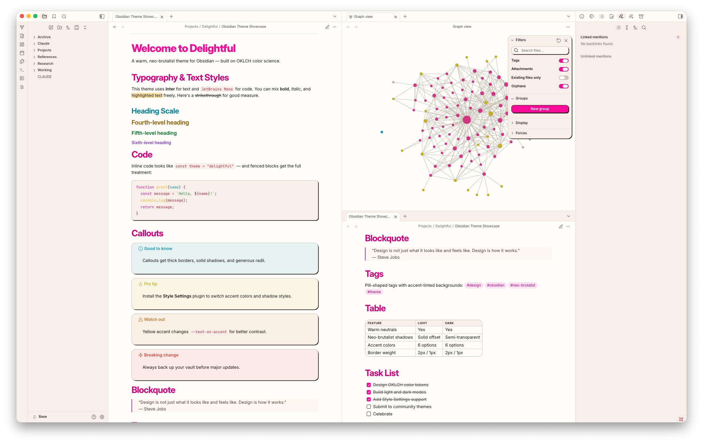

  <picture>
    <source media="(prefers-color-scheme: dark)" srcset="screenshots/Obsidian-Dark.png" />
    <source media="(prefers-color-scheme: light)" srcset="screenshots/Obsidian-Light.png" />
    
  </picture>

<h1 align="center">Delightful for Obsidian</h1>

  A warm, neo-brutalist theme for <a href="https://obsidian.md">Obsidian</a>, built on the <a href="https://github.com/kylesnav/delightful-design-system">Delightful Design System</a>.

---

## Install

### From Obsidian Community Themes

1. Open **Settings** > **Appearance**
2. Click **Manage** next to Themes
3. Search for "Delightful"
4. Click **Install and use**

### Manual

1. Download `manifest.json` and `theme.css`
2. Create `.obsidian/themes/Delightful/` in your vault
3. Place both files inside
4. Select **Delightful** in **Settings** > **Appearance**

## Features

- **OKLCH color palette** — warm neutrals (hue 70), 6 accent families, never cold gray
- **Neo-brutalist aesthetic** — solid offset shadows, 2px borders, generous radii
- **Full light & dark mode** — warm dark backgrounds with adjusted accent brightness
- **6 accent colors** — Pink (default), Danger, Gold, Cyan, Green, Purple via Style Settings
- **Fluid heading scale** — 2.488em down to 1em with decreasing weights (800 to 600)
- **16 custom checkboxes** — cancelled, important, question, forwarded, scheduled, star, info, idea, pro, con, bookmark, location, fire, up, down, win
- **Per-type callout colors** — 12 callout types with semantically matched colors
- **Full graph view theming** — color-coded nodes for tags, attachments, unresolved
- **Canvas styling** — neo-brutalist nodes with 6 color-coded types
- **Plugin compatibility** — Dataview tables, Kanban boards, Tasks plugin, Calendar widget
- **Mobile optimization** — larger touch targets, reduced shadows, phone heading scale

## Style Settings

Install the [Style Settings](https://github.com/mgmeyers/obsidian-style-settings) plugin for additional customization:

| Setting | Options |
|---|---|
| Accent Color | Pink (default), Danger, Gold, Cyan, Green, Purple |
| Shadow Style | Neo-brutalist (default), Subtle, None |
| Border Weight | 2px (default), 1px |
| Heading Scale | Normal (default), Compact, Large |
| Alternative Checkboxes | On (default), Off |
| Colorful Headings | Off (default), On |

## Design System

<strong>Color architecture</strong>

 

| Layer | Purpose |
|---|---|
| **Primitives** | Raw OKLCH values — neutrals (0–950) and 6 accent families |
| **Semantic tokens** | Background, text, border, and accent colors for light/dark |
| **Component tokens** | Typography scale, spacing, radii, motion, easing |

**Typography:**
- Interface & text: native UI stack (`system-ui`, `-apple-system`, sans-serif)
- Code: native monospace stack (`ui-monospace`, `"SF Mono"`, monospace)
- Headings: tight tracking, strong weights, compressed line-height

## License

[MIT](LICENSE)
