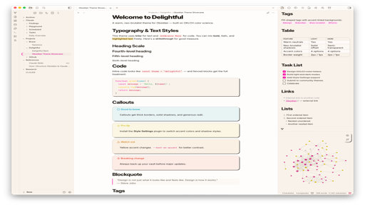

# Delightful

A warm, neo-brutalist theme for [Obsidian](https://obsidian.md) based on the Delightful Design System.

## Features

- **Warm color palette** — OKLCH-based neutrals with a subtle warm tint (hue 70), never cold gray
- **Neo-brutalist aesthetic** — Solid offset shadows, 2px borders, and generous radii on modals, menus, buttons, callouts, code blocks, and tables
- **Inter + JetBrains Mono** — Variable font weights with tight letter-spacing on headings and Inter's alternate character variants (`cv02`, `cv03`, `cv04`, `cv11`)
- **Full light & dark mode** — Carefully tuned for both, with warm dark backgrounds and adjusted accent brightness
- **5 accent colors** — Pink (default), Danger, Gold, Cyan, and Green, switchable via Style Settings
- **Button micro-interactions** — Lift on hover, flatten on press
- **Pill-shaped tags** — Rounded with accent-tinted backgrounds
- **Fluid heading scale** — 2.488em down to 1em with decreasing variable-font weights (760 to 600)

## Style Settings

Install the [Style Settings](https://github.com/mgmeyers/obsidian-style-settings) plugin for additional customization:

| Setting | Options |
|---|---|
| **Accent Color** | Pink (default), Danger, Gold, Cyan, Green |
| **Shadow Style** | Neo-brutalist (default), Subtle, None |
| **Border Weight** | 2px (default), 1px |

## Installation

### From Obsidian Community Themes
1. Open **Settings** > **Appearance**
2. Click **Manage** next to Themes
3. Search for "Delightful"
4. Click **Install and use**

### Manual Installation
1. Download `manifest.json` and `theme.css` from this repository
2. Create a folder called `Delightful` inside your vault's `.obsidian/themes/` directory
3. Place both files in that folder
4. Open **Settings** > **Appearance** and select **Delightful**

## Design System

This theme is a translation of the [Delightful Design System](https://github.com/kylesnav/delightful-design-system) — a comprehensive token system built on OKLCH color science with a neo-brutalist visual language.

### Color Architecture

| Layer | Purpose |
|---|---|
| **Primitives** | Raw OKLCH values — neutrals (0-950) and five accent families |
| **Semantic tokens** | Background, text, border, and accent colors for light/dark modes |
| **Component tokens** | Typography scale, spacing grid, radii, motion, and easing |

### Typography

- **Interface & text**: Inter (variable, 100-900)
- **Code**: JetBrains Mono (variable, 100-800)
- **Headings**: Tight tracking (-0.03em for h1-h2, -0.02em for h3-h4), heavy weights, compressed line-height

## License

MIT
