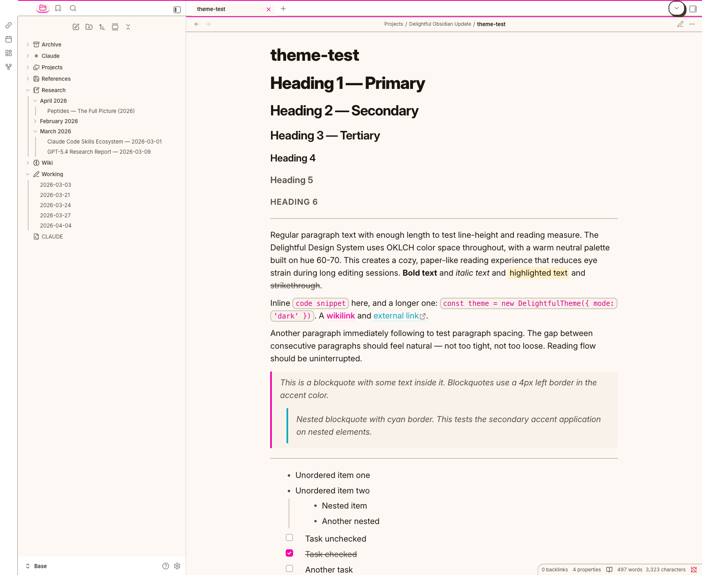
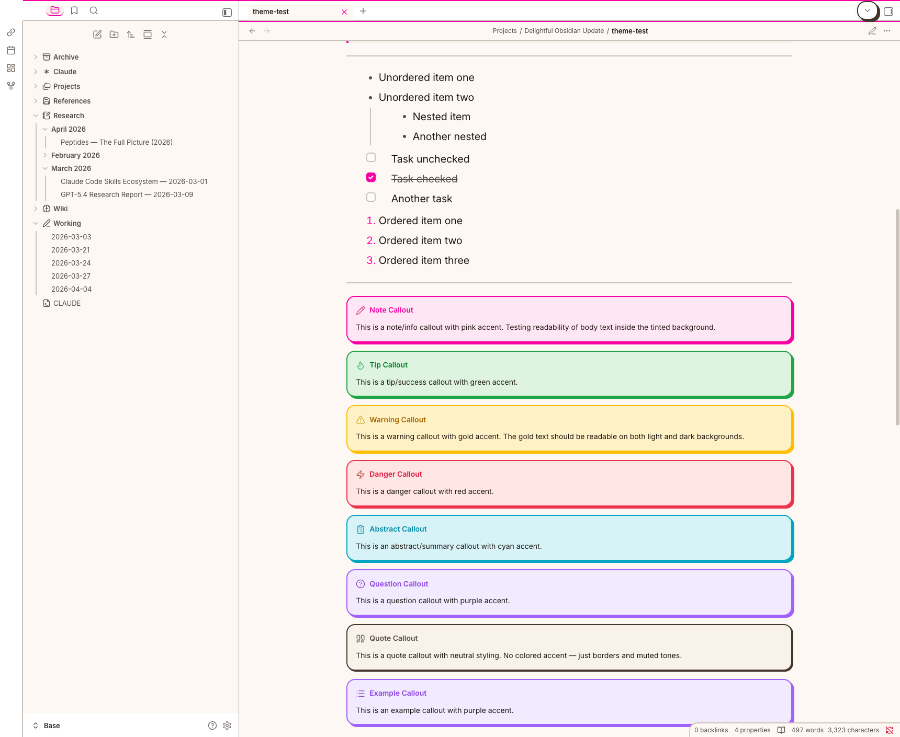
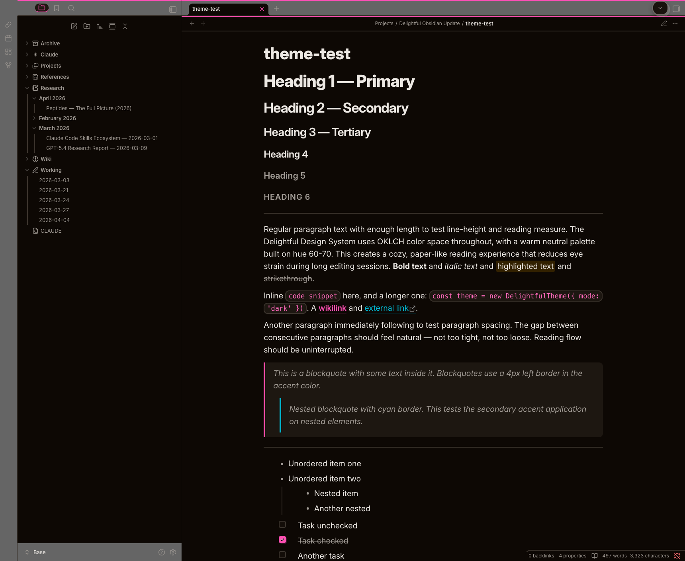
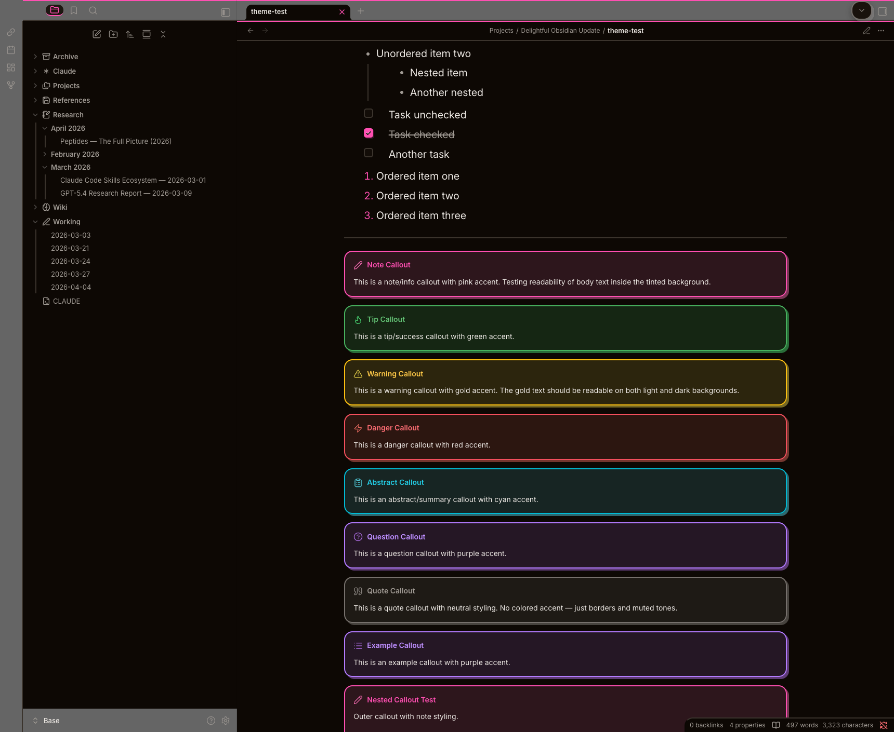

<p align="center">
  
</p>

<h1 align="center">Delightful</h1>

<p align="center">
  A warm, neo-brutalist theme for <a href="https://obsidian.md">Obsidian</a>.<br>
  Bold borders. Solid shadows. Warm neutrals. Never cold gray.
</p>

<p align="center">
  <a href="#install">Install</a> &nbsp;&middot;&nbsp;
  <a href="#features">Features</a> &nbsp;&middot;&nbsp;
  <a href="#supported-plugins">Plugins</a> &nbsp;&middot;&nbsp;
  <a href="#style-settings">Style Settings</a> &nbsp;&middot;&nbsp;
  <a href="#screenshots">Screenshots</a>
</p>

---

## Screenshots

### Light Mode

| | |
|---|---|
|  |  |
| Warm paper tones | 8 color-coded callout types |

### Dark Mode

| | |
|---|---|
|  |  |
| Cozy dark neutrals | Visible tinted backgrounds |

## Features

- **Full light and dark mode** -- warm tan in light, cozy neutrals in dark
- **Three-tier OKLCH token architecture** -- primitives, semantic, and component tokens with perceptually uniform color math
- **Neo-brutalist aesthetic** -- bold 2px borders, solid zero-blur offset shadows, generous radii (10/16/24px)
- **Warm cream palette** -- warm neutrals on hue 70 with 6 accent families. No cold grays anywhere
- **8 color-coded callout types** -- note, tip, warning, danger, abstract, question, quote, example with semantic colors and shadows
- **Distinct heading scale** -- H1 (2.074em) through H6 (1em), each level visibly different
- **Syntax highlighting** -- keywords (pink), strings (gold), functions (cyan), comments (green), types (purple), numbers (red)
- **Themed tables** -- rounded card treatment with uppercase muted headers, alternating row tints, hover states
- **Task checkboxes** -- warm accent hover preview, shadow on checked state, click squeeze animation
- **Canvas support** -- 6 color-coded node types with tinted backgrounds, styled edges and controls
- **Graph view** -- themed control panel with styled sliders, toggles, color group pickers
- **Mobile optimized** -- larger touch targets (44px minimum), reduced shadows, phone-appropriate heading scale
- **Themed scrollbars** -- subtle thumb with accent hover, transparent track
- **Motion system** -- 5 durations (100ms-500ms), 5 easings including spring curves via `linear()`. Hover lifts, press squeezes, entrance animations

## Supported Plugins

Tested and styled out of the box:

| Plugin | What's Styled |
|--------|--------------|
| [Style Settings](https://github.com/mgmeyers/obsidian-style-settings) | Full customization panel (see below) |
| [Dataview](https://github.com/blacksmithgu/obsidian-dataview) | Tables and lists with neo-brutalist borders and card styling |
| [Kanban](https://github.com/mgmeyers/obsidian-kanban) | Board, lanes, cards, headers, drag handles, add buttons |
| [Calendar](https://github.com/liamcain/obsidian-calendar-plugin) | Sidebar widget with activity dots, nav arrows, day cells |
| [Tasks](https://github.com/obsidian-tasks-group/obsidian-tasks) | Priority indicators, due dates, overdue styling, query results |
| [Excalidraw](https://github.com/zsviczian/obsidian-excalidraw-plugin) | Canvas wrapper, toolbar, panels |
| [Advanced Tables](https://github.com/tgrosinger/advanced-tables-obsidian) | Table editor with themed controls |
| [Templater](https://github.com/SilentVoid13/Templater) | Modal and suggestion styling |
| [Obsidian Git](https://github.com/denolehov/obsidian-git) | Status bar and diff view |
| [Outliner](https://github.com/vslinko/obsidian-outliner) | List indentation guides |
| [Hover Editor](https://github.com/nothingislost/obsidian-hover-editor) | Popover card styling |

## Install

### Community Themes (recommended)

1. Open **Settings > Appearance**
2. Click **Manage** next to Themes
3. Search for **Delightful**
4. Click **Install and use**

### Manual

1. Download `theme.css` and `manifest.json` from [Releases](https://github.com/kylesnav/obsidian-delightful/releases)
2. Create `.obsidian/themes/Delightful/` in your vault
3. Place both files inside
4. Select **Delightful** in **Settings > Appearance**

## Style Settings

Install [Style Settings](https://github.com/mgmeyers/obsidian-style-settings) for these options:

| Setting | Options | Default |
|---------|---------|---------|
| **Accent Color** | Pink, Danger, Gold, Cyan, Green, Purple | Pink |
| **Shadow Style** | Neo-brutalist, Subtle, None | Neo-brutalist |
| **Border Weight** | 2px, 1px | 2px |
| **Heading Scale** | Normal, Compact, Large | Normal |
| **Animations** | On, Off | On |

## Building from Source

The theme is built from 18 modular CSS files that are concatenated into a single `theme.css`:

```bash
# Build theme.css from source modules
node build.js

# Watch mode -- rebuilds on file changes
node build.js --watch
```

### Source Module Structure

```
src/
  00-tokens.css          # OKLCH primitives, semantic tokens, component tokens
  01-obsidian-vars.css   # Obsidian CSS variable mappings
  02-typography.css      # Heading scale, paragraph rhythm, inline code
  03-workspace.css       # Sidebar, tabs, status bar, ribbons
  04-editor-core.css     # Base editor styling
  04-editor-rich.css     # Callouts, code blocks, embeds, tables
  05-components.css      # Buttons, inputs, toggles, modals, menus
  07-animations.css      # Hover, press, entrance animations
  08-style-settings.css  # Style Settings integration
  09-canvas.css          # Canvas nodes, edges, controls
  10-graph.css           # Graph view theming
  11-mobile.css          # Mobile-specific overrides
  plugins/
    calendar.css         # Calendar plugin
    dataview.css         # Dataview tables and lists
    excalidraw.css       # Excalidraw toolbar and panels
    kanban.css           # Kanban board, lanes, cards
    secondary.css        # Advanced Tables, Templater, Git, Outliner, Hover Editor
    tasks.css            # Tasks plugin query results and checkboxes
```

### Visual Audit

```bash
# Capture 60 CDP screenshots across light/dark modes
python3 scripts/visual-audit.py
```

Requires Obsidian running with `--remote-debugging-port=9222`.

## Part of Delightful

This theme is part of the [Delightful Design System](https://github.com/kylesnav/delightful-design-system) -- a cross-platform design system spanning Obsidian, VS Code, Ghostty, iTerm2, Starship, and Claude Code.

All ports share the same OKLCH color palette and neo-brutalist design language.

## License

[MIT](LICENSE)
